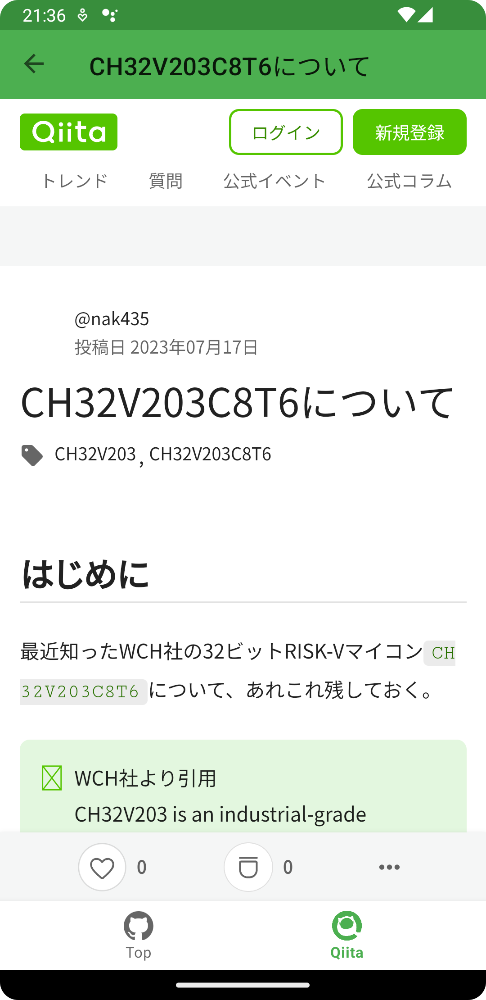

# hello-bottom-navigation

BottomNavigationView と Jetpack Navigation の連携でタブを切り替える。

## Technology stack

### Architecture

* MVVM アーキテクチャパターン  
  

* [Android 推奨のアーキテクチャ](https://developer.android.com/jetpack/guide?hl=ja) に準拠
  * app モジュール: UI Layer
  * domain モジュール: Domain Layer
  * data モジュール: Data Layer

* [クリーンアーキテクチャ](https://www.amazon.co.jp/exec/obidos/ASIN/4048930656/maple036-22/) に準拠
  * app モジュール: Presenters
  * domain モジュール: Use Case 、 Entity
  * data モジュール: Controllers 、 Gateways

### Android teck stack

* MVVM  
  ViewModel + LiveData + ビューバインディング  
* フッターメニュー  
  BottomNavigtionView  
* ルーティング  
  [Jepack Navigation](https://developer.android.com/guide/navigation?hl=ja)

### Dependencies

* 通信ライブラリ  
  [Retrofit](https://square.github.io/retrofit/)

* DI(依存性の注入)ライブラリ  
  [Hilt](https://dagger.dev/hilt/)

* JSON <=> String 変換ライブラリ  
  [Moshi](https://github.com/square/moshi/tree/master)

* イメージロードライブラリ  
  [Glide](https://github.com/bumptech/glide)

* [Secrets Gradle プラグイン](https://developers.google.com/maps/documentation/android-sdk/secrets-gradle-plugin?hl=ja)

### その他 teck stack

* [Kotlin DSL](https://docs.gradle.org/current/userguide/kotlin_dsl.html)

* [バージョンカタログ](https://docs.gradle.org/current/userguide/platforms.html)


## 画面スクリーンショット

　　  
　　


##  設計

### Navigation


## 使い方

1. git clone で本プロジェクトをダウンロード
2. Android Studio で本プロジェクトを開く  
   `Android Studio Flamingo | 2022.2.1 Patch 2` を推奨
3. [Qiita](https://qiita.com/) にログインしてトークンを取得し、local.properties にトークンを設定
    ```
    QIITA_TOKEN=XXXXX2082a357YYYYYa165a88c5d194cb7dZZZZZ
    ```
4. ビルド


## Commit Tree

|コミット |
|----------------|
|[hello-architecture-retrofit をベースにしてプロジェクトを作成](https://github.com/seabat/hello-bottom-navigation/commit/62fe40067628b1238118a89d782a08013ecd5e55)
|[Groovy から KTS へ移行](https://github.com/seabat/hello-bottom-navigation/commit/82ddd3c951627e89b206d9aea18ef35cfdc34d01) |
|[バージョンカタログへ移行](https://github.com/seabat/hello-bottom-navigation/commit/1b0376a4f10f7c65d72bca7cd228666422c540f8)|
|[BottomNavigationView を追加](https://github.com/seabat/hello-bottom-navigation/commit/1c04d7c6fc093946654e15d6ec0f8ba41c587256)|
|[タブ内で遷移した場合にタブの選択を正しく反映する](https://github.com/seabat/hello-bottom-navigation/commit/06d5baf995c09a26549684e09837c805d983d482)|
|[Qiita 記事を Qiita タブに表示する](https://github.com/seabat/hello-bottom-navigation/commit/048c1d93544e2c37f7016588bb1beadc9a4c8279)|
|[DSL in v9.0 からライブラリ側で targetSdk を指定する必要は無くなった](https://github.com/seabat/hello-bottom-navigation/commit/eb5d071cc3188ffa45387088af2ed0fa787f7918)|
|[BottomSheetDialog で作成した Qiita 検索画面を navigation に追加](https://github.com/seabat/hello-bottom-navigation/commit/92076328243739d0b7b2844be3be9e331abdf656)|
|[Qiita 検索画面のUI を作成](https://github.com/seabat/hello-bottom-navigation/commit/f2fbdcec91d73a0582f522aaaa19acafb229004a)|
|[Theme.MaterialComponents.Light.NoActionBar を適用すると Button のカラーが指定できない](https://github.com/seabat/hello-bottom-navigation/commit/6a0575b992b869320ab51d518be1e07fb233ca47)|
|[日付ピッカーを表示する](https://github.com/seabat/hello-bottom-navigation/commit/19f177eb49948c85c96197d7866045616338755e)|
|[BottomSheetDialog からデータを返す](https://github.com/seabat/hello-bottom-navigation/commit/1d302ea67d1cdfaf17daf99c96ccf28f24ae45d3)|
|[ヘッダーから検索ヒット合計数を取得する](https://github.com/seabat/hello-bottom-navigation/commit/ed79c00be896ceb567e2261660e96ab56e740c59)|
|[Date を和暦に変換](https://github.com/seabat/hello-bottom-navigation/commit/13d6e88344a60538d79a19fc4214f17b441345ed)|
|[画面遷移の際に BottomNavigationView を非表示にする](https://github.com/seabat/hello-bottom-navigation/commit/f9838c342df0d022c5d37a31b3b40e2b2c9a603b)|


## トラブル解消

#### タブAのサブページを表示している状態でタブBに遷移し、タブAに戻ってもタブAが選択状態にならない事象を解消する

事象  
https://github.com/seabat/hello-bottom-navigation/assets/4818667/1d14739d-abf8-4d46-b333-628c5172e284

対策  
`setOnItemSelectedListener` を override し、true
を返す。([BottomNavigationViewとJetpack Navigationを組み合わせた画面遷移の実装の勘所](https://inside.luchegroup.com/entry/2023/05/08/113236)
を参考)

```diff
    override fun onCreate(savedInstanceState: Bundle?) {
        super.onCreate(savedInstanceState)
        binding = ActivityMainBinding.inflate(layoutInflater)
        setContentView(binding.root)

        val bottomNav = binding.bottomNav
        val fragment = supportFragmentManager.findFragmentById(R.id.nav_host_fragment) as NavHostFragment

        setupWithNavController(bottomNav, fragment.navController)
+       // NOTE: setOnItemSelectedListener の上書きは BottomNavigationView#setupWithNavController
+       //       の後に実行する。
+       bottomNav.setOnItemSelectedListener { item ->
+           NavigationUI.onNavDestinationSelected(item, fragment.navController)
+           true
+       }
    }
```

解決  
https://github.com/seabat/hello-bottom-navigation/assets/4818667/9c280b53-d353-4cf1-b923-ccf754bed149

